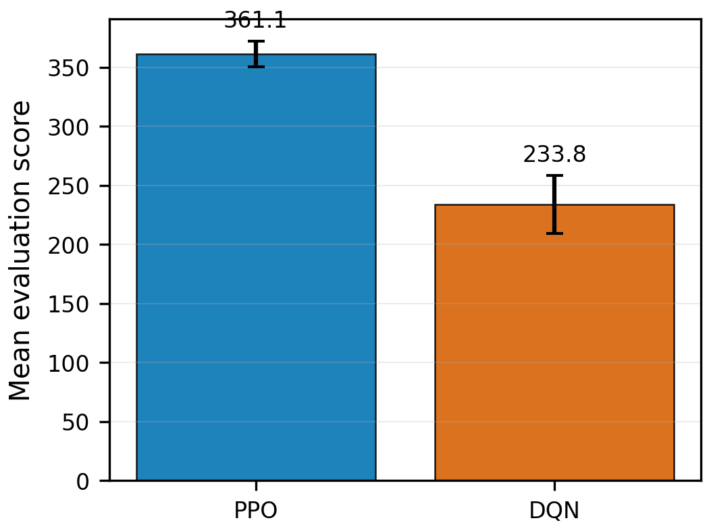
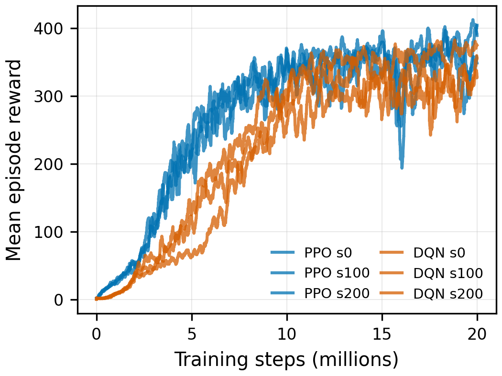
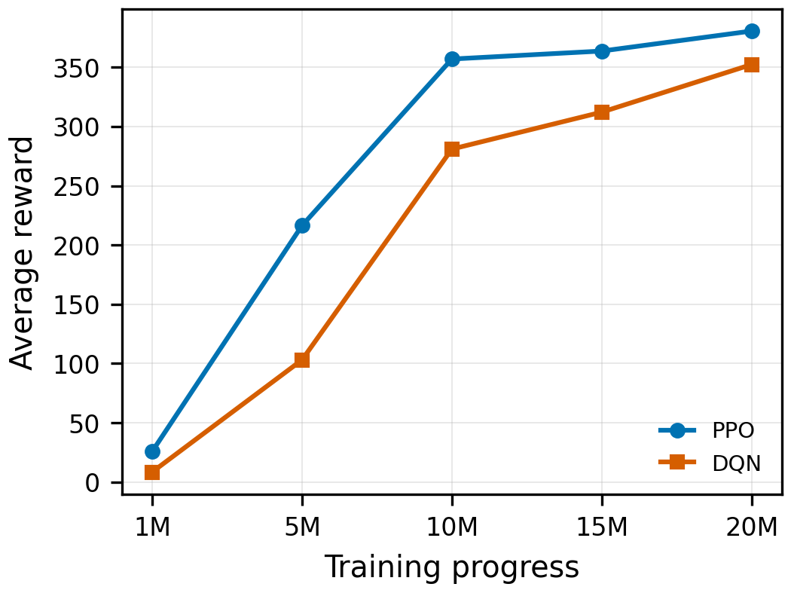

# RL-Atari-Breakout

This repository trains and evaluates PPO and DQN agents on Atari Breakout. It provides a unified Stable-Baselines3 pipeline for training, evaluation, video recording, and performance comparison across multiple random seeds.

## Overview

The project compares PPO and DQN under a shared Atari preprocessing pipeline:

- Environment: `BreakoutNoFrameskip-v4`
- Training seeds: `0, 100, 200`
- Training budget: 20M environment steps per algorithm per seed
- Evaluation: 100 episodes per final model
- Comparison dimensions: final score, learning curve, sample efficiency, and training stability

Generated artifacts such as models, TensorBoard logs, evaluation JSON files, figures, and videos are ignored by git by default.

## Final Results

Final results are summarized from `results/comparison_report.json`.

| Algorithm | Seeds | Mean score across seeds | Std across seeds |
|---|---:|---:|---:|
| PPO | 3 | 361.10 | 10.97 |
| DQN | 3 | 233.75 | 24.49 |

In this experimental setting, PPO outperformed DQN by `127.35` mean evaluation points across seeds.

<p align="center">
  
</p>

Per-seed evaluation results:

| Algorithm | Seed | Evaluation policy | Mean | Std | Median | Min | Max |
|---|---:|---|---:|---:|---:|---:|---:|
| PPO | 0 | sampled via `auto` | 361.29 | 111.62 | 399.0 | 27 | 859 |
| PPO | 100 | sampled via `auto` | 374.45 | 74.29 | 400.0 | 55 | 430 |
| PPO | 200 | sampled via `auto` | 347.57 | 83.53 | 374.5 | 54 | 479 |
| DQN | 0 | epsilon-greedy, eps=0.05 | 214.68 | 137.61 | 198.5 | 21 | 418 |
| DQN | 100 | epsilon-greedy, eps=0.05 | 218.26 | 131.96 | 222.0 | 10 | 412 |
| DQN | 200 | epsilon-greedy, eps=0.05 | 268.32 | 128.84 | 323.0 | 29 | 434 |

<p align="center">
  
</p>

<p align="center">
  
</p>

## Repository Layout

```text
PPO-Breakout/
├── train.py          # PPO/DQN training entry point
├── evaluate.py       # Evaluation, JSON export, and best-episode video recording
├── watch.py          # Real-time policy visualization
├── compare.py        # TensorBoard/evaluation parsing and figure/report generation
├── utils.py          # Environment creation, preprocessing, and shared helpers
├── requirements.txt  # Python dependencies
├── README.md         # Documentation
├── models/           # Generated model checkpoints, ignored by git
├── logs/             # Generated TensorBoard logs, ignored by git
├── results/          # Generated evaluation files and plots, ignored by git
└── videos/           # Generated videos, ignored by git
```

## Installation

Python 3.12 and a CUDA-enabled PyTorch build are recommended.

```shell
conda create -n breakout python=3.12 -y
conda activate breakout

pip3 install torch --index-url https://download.pytorch.org/whl/cu126
pip install -r requirements.txt
AutoROM --accept-license
```

The final environment used:

- `stable_baselines3==2.8.0`
- `gymnasium==1.2.3`
- `ale-py==0.11.2`
- `torch==2.11.0+cu126`
- `matplotlib==3.10.9`
- `tensorboard==2.20.0`

## Environment and Preprocessing

Both algorithms use `BreakoutNoFrameskip-v4`.

Training wrappers:

- `make_atari_env(..., n_envs=8, vec_env_cls=SubprocVecEnv)`
- `VecFrameStack(n_stack=4)`
- `VecTransposeImage`

Evaluation wrappers:

- `AtariPreprocessing(frame_skip=4, screen_size=84, grayscale_obs=True, scale_obs=False, terminal_on_life_loss=False)`
- `FireResetEnv`
- `FrameStackObservation(4)`

Evaluation uses reproducible reset seeds by default. With `--seed 0`, episode `i` is reset with seed `0 + i`.

## Training

Train one PPO and one DQN model:

```shell
conda activate breakout

python train.py --algo ppo --seed 0 --steps 20000000 --envs 8
python train.py --algo dqn --seed 0 --steps 20000000 --envs 8
```

The full experiment uses seeds `0, 100, 200`.

Checkpoint and final model outputs:

- `models/{algo}/{algo}_breakout_seed{seed}_final.zip`
- `models/{algo}/{algo}_breakout_seed{seed}_{step}_steps.zip`
- `logs/{algo}/{ALGO}_seed{seed}_*/events.out.tfevents.*`

Resume from a checkpoint:

```shell
python train.py --algo ppo --seed 0 --steps 20000000 --envs 8 --resume models/ppo/ppo_breakout_seed0_5000000_steps.zip
```

## Evaluation

Default evaluation:

```shell
python evaluate.py --model models/ppo/ppo_breakout_seed0_final.zip --episodes 100
python evaluate.py --model models/dqn/dqn_breakout_seed0_final.zip --episodes 100
```

Default policy semantics:

- PPO: sampled action prediction.
- DQN: epsilon-greedy action selection with `epsilon=0.05`, following the original DQN evaluation convention.

Policy options:

| Option | Meaning |
|---|---|
| `--policy auto` | Recommended default. PPO uses sampled actions; DQN uses epsilon-greedy with eps=0.05. |
| `--policy epsilon-greedy --dqn-eval-eps 0.05` | Explicit DQN epsilon-greedy evaluation. |
| `--policy deterministic` | Pure greedy / deterministic action selection, mainly for diagnostics or ablation. |
| `--policy sampled` | Uses the model's native stochastic mode. For DQN, this uses SB3's internal exploration rate and is not the final protocol. |

Record only the best episode from one evaluation run:

```shell
python evaluate.py --model models/dqn/dqn_breakout_seed0_final.zip --episodes 100 --record-video
```

The evaluation JSON records scores, step counts, policy settings, and best-video metadata.

## Visualization

```shell
python watch.py --model models/ppo/ppo_breakout_seed0_final.zip --episodes 5
python watch.py --model models/dqn/dqn_breakout_seed0_final.zip --episodes 5
```

`watch.py` uses the same `--policy auto` semantics as `evaluate.py`. To inspect pure greedy DQN behavior:

```shell
python watch.py --model models/dqn/dqn_breakout_seed0_final.zip --policy deterministic
```

## Comparison

After training and evaluation:

```shell
python compare.py --seeds 0 100 200
```

Generated outputs:

- `results/learning_curves.png`
- `results/final_performance.png`
- `results/sample_efficiency.png`
- `results/comparison_report.json`

When multiple DQN evaluation JSON files exist for the same seed, `compare.py` prioritizes the final DQN protocol: `epsilon-greedy, epsilon=0.05`. Legacy pure-greedy results are treated as lower-priority diagnostic files.

## Notes

- The results are specific to the implementation, hyperparameters, training budget, seeds, and Breakout preprocessing used here.
- Large generated artifacts are ignored by git. Re-run training/evaluation to regenerate them.
